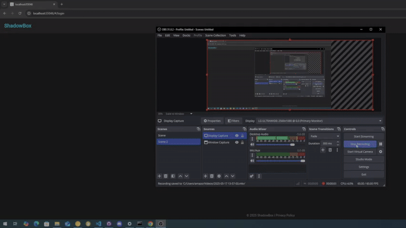
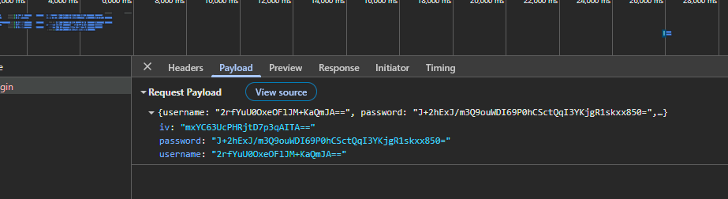

# ShadowBox




**Local Encrypted File Storage You Control**

ShadowBox is a simple, self-hosted encrypted file storage system. You can run it locally on your PC, a Raspberry Pi, or a server on your network. Once it's running, you can access it from any device on your LAN — or forward a port to access it remotely or connect it to a domain.

The frontend is a basic example hosted on GitHub. The backend is built with Python using Flask. Files are encrypted before being stored and only decrypted when downloaded. No original data is saved.

This is an early version, but it works. You can use it as-is, improve it, or take the core idea and build your own version.

---

## Features
- Files synchronous on all devices with same account
- AES-256 encrypted uploads — files are stored encrypted, not raw
- Decryption only happens when a file is downloaded
- File deletion completley removes file from db and device
- Simple Flask-based backend you can run anywhere
- Web interface included (basic Dart frontend as a starting point)
- You control the key — planning to support local key storage soon

---

## Roadmap

- Let users manage their encryption keys locally
- User accounts and file-level permissions
- File versioning
- Shared folders
- Optional support for decentralized storage (e.g. IPFS)

---

## Tech Stack

- Backend: Python, Flask, SQLAlchemy
- Frontend: Dart (just an example, you can replace it)
- Encryption: AES-256
- Database: SQLite (easy to swap out)

---

## Getting Started

### Requirements

- Python 3.8 or higher
- Dart (if modifying or running the frontend)

---

### Download & Run

#### Step 1: Clone the repo

```bash
git clone https://github.com/dillionhuston/Shadow.git
cd Shadow
```

### Step 2: Run the backend
```bash 
cd backend
pip install -r requirements.txt
flask run
```

### Step 3: Run the frontend
```bash
cd ../frontend
dart pub get
dart run

```

### Contributing 

-  Improve frontend 
-  Clean up backend
-  Custom features
-  Test encryption

### Why Shadowbox?

- You keep Control - your files, your server, your rules
- NO third-party storage or tracking 
- Lightweight, easy to run on low-power devices(Rasberry PI)
- Good base for more advanced projects

### License 

- MIT - free to use


